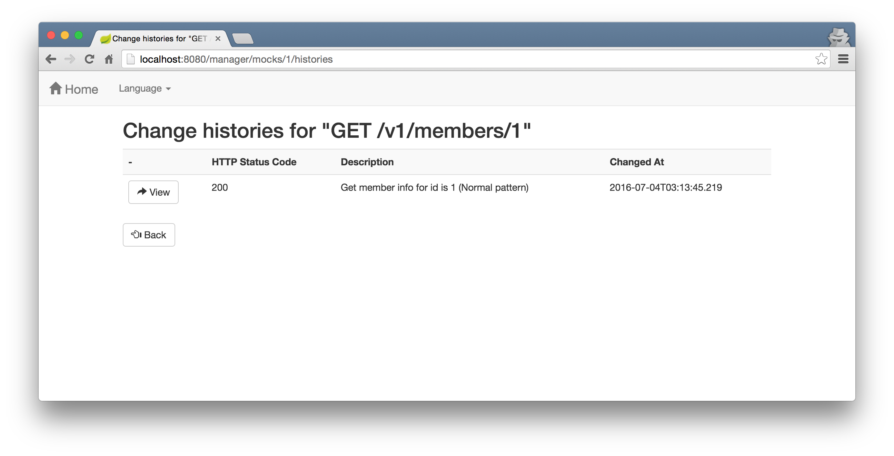
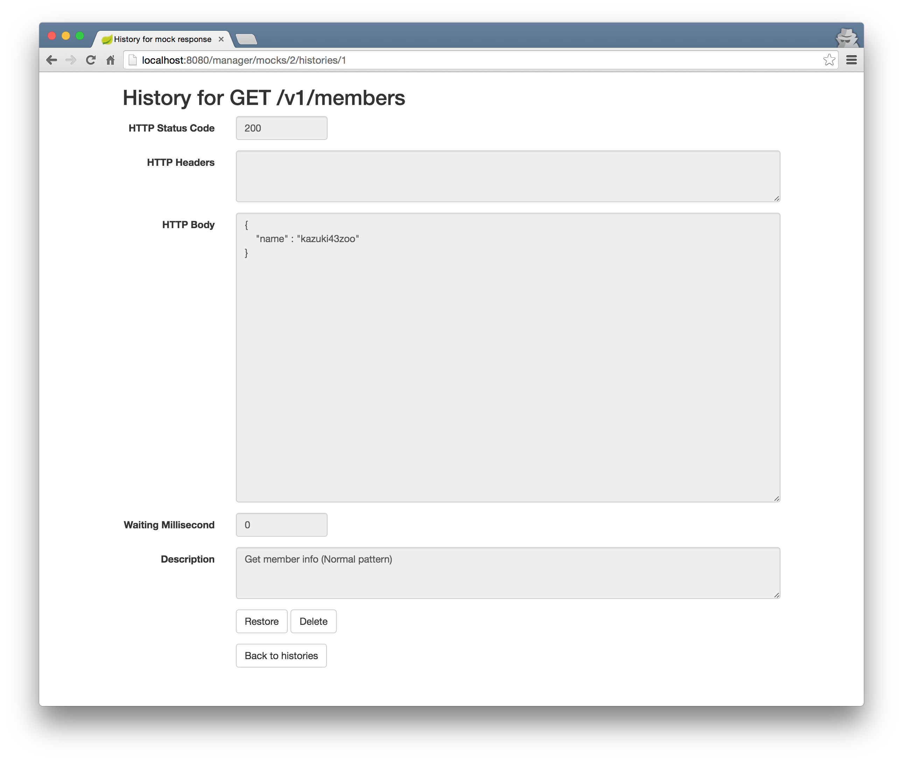

[](https://www.versioneye.com/user/projects/57dcb1dc037c200040cdcef9)
[](https://www.codacy.com/app/kazuki43zoo/api-stub?utm_source=github.com&amp;utm_medium=referral&amp;utm_content=kazuki43zoo/api-stub&amp;utm_campaign=Badge_Grade)

# api-stub
Stub for API

* [日本語](./README_ja.md)

## Requirements for Maven compile and runtime

* Java SE 8 (JDK 1.8)

## Requirements for IDE

### Install lombok

If you use a IDE(STS, IDEA, etc...), please install the lombok. About how to install the lombok, please see as follows:

* http://jnb.ociweb.com/jnb/jnbJan2010.html#installation
* https://projectlombok.org/download.html

### Groovy Eclipse

If you use a STS(or Eclipse), please install the Groovy Eclipse plugin. About how install the Groovy Eclipse, please see as follow:

* https://github.com/groovy/groovy-eclipse/wiki

## Clone project

```bash
$ git clone https://github.com/kazuki43zoo/api-stub.git
```

## Build

```bash
$ cd api-stub
$ ./mvnw clean install
```

## Run application

```bash
$ java -jar api-stub-app/target/api-stub.jar
```

> **Note**
> 
> Default server port is `8080`.

## Stop application

Type "Ctrl + C"

## How to change server port

If you want to change server port, please run application as follow (adding `--server.port=xxxx`):

e.g.)

```bash
java -jar api-stub.jar --server.port=9999
```

## How to use the management screen

### Search mock responses

[http://localhost:8080/](http://localhost:8080/)


### Add a new mock response


### Edit a mock response


### View editing histories



### Restore and Delete editing history



## How to access mock API

### Default response (200 OK)

```bash
$ curl -D - http://localhost:8080/api/v1/members/1
HTTP/1.1 200 OK
Server: Apache-Coyote/1.1
x-correlation-id: 247125e6-44b3-4938-a196-9d38f528a103
Content-Length: 0
Date: Sun, 03 Jul 2016 18:20:23 GMT

```

### Mock response

```bash
$ curl -D - http://localhost:8080/api/v1/members/1
HTTP/1.1 200 OK
Server: Apache-Coyote/1.1
x-correlation-id: 5941f298-e00b-4adc-ad59-51610f50ac12
Content-Type: application/json;charset=UTF-8
Transfer-Encoding: chunked
Date: Sun, 03 Jul 2016 18:21:25 GMT

{
    "name": "kazuki43zoo"
}
```

### Evidence

Evidence(request headers, request parameters, request body and upload files) are outouting the `evidence` directory on your application root.

```text
${APP_ROOT}/evidence
└─api
    └─v1
        └─members
            └─1 (* request path)
                └─GET (* http method)
                    └─20160630151351369_dbf5d14d-179c-418d-8c25-ad3e55fefe37 (* ${datetime}_${x-correlation-id})
                        + request.json (* include http headers, request parameters)
                        + body.txt (* request body)
                        + uploadFile_01_xxxx.png (* upload files)
```

You can disable outputing evidence as follow:

```properties
# Disable request header, request parameter, request body
api.evidence.disabled-request=true
# Disable upload files
api.evidence.disabled-upload=true
```

### Console logs

```text
...
2016-06-30 15:09:48.555  INFO 2372 --- [nio-8080-exec-6] GET /api/v1/members/1                    : Start.
2016-06-30 15:09:48.555  INFO 2372 --- [nio-8080-exec-6] GET /api/v1/members/1                    : Evidence Dir : D:\Users\xxx\git\api-stub\evidence\api\v1\members\1\GET\20160630150948555_878abb0d-4828-479f-83cf-3003ae257414
2016-06-30 15:09:48.633  INFO 2372 --- [nio-8080-exec-6] GET /api/v1/members/1                    : Request      : {"parameters":{},"headers":{"host":["localhost:8080"],"user-agent":["curl/7.46.0"],"accept":["*/*"]}}
2016-06-30 15:09:48.664  INFO 2372 --- [nio-8080-exec-6] GET /api/v1/members/1                    : Response     : {"httpStatus":"OK","headers":{"x-correlation-id":["878abb0d-4828-479f-83cf-3003ae257414"]}}
2016-06-30 15:09:48.664  WARN 2372 --- [nio-8080-exec-6] GET /api/v1/members/1                    : Mock Response is not found.
2016-06-30 15:09:48.664  INFO 2372 --- [nio-8080-exec-6] GET /api/v1/members/1                    : End.
...
```

## Access the database

You can access the database dilectlly.

### Using H2 admin console

[http://localhost:8080/h2-console/](http://localhost:8080/h2-console/)

| Item | Value |
| ---- | ----- |
| Driver Class | `org.h2.Driver` |
| JDBC URL | `jdbc:h2:~/db/api-stub` |
| User Name | `sa` |
| Password | |

### Using JDBC Driver

Please download jdbc driver on [here](http://repo2.maven.org/maven2/com/h2database/h2/1.4.191/h2-1.4.191.jar).

| Item | Value |
| ---- | ----- |
| Driver Class | `org.h2.Driver` |
| JDBC URL | `jdbc:h2:tcp://localhost/~/db/api-stub` |
| User | `sa` |
| Password | |


## Appendix

### Install api-stub-core into your application

Install the `api-stub-core` into local repository. (**Important**)

```bash
$ cd {api-stub-dir}
$ ./mvnw clean install
```

Add the `api-stub-core` into your pom file as follow:

```xml
<dependency>
    <groupId>com.kazuki43zoo</groupId>
    <artifactId>api-stub-core</artifactId>
    <version>1.0.0-SNAPSHOT</version>
</dependency>
```

## Known Issues

https://github.com/kazuki43zoo/api-stub/issues

## Feature request and bug report

https://github.com/kazuki43zoo/api-stub/issues/new

