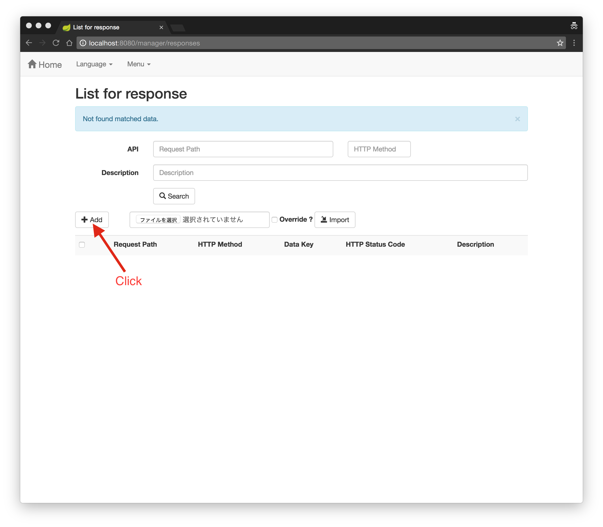
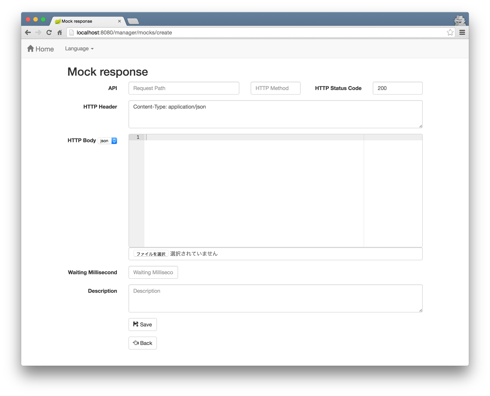
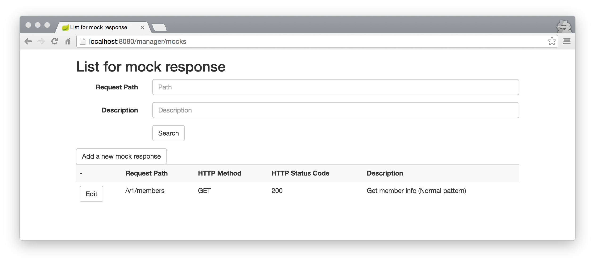
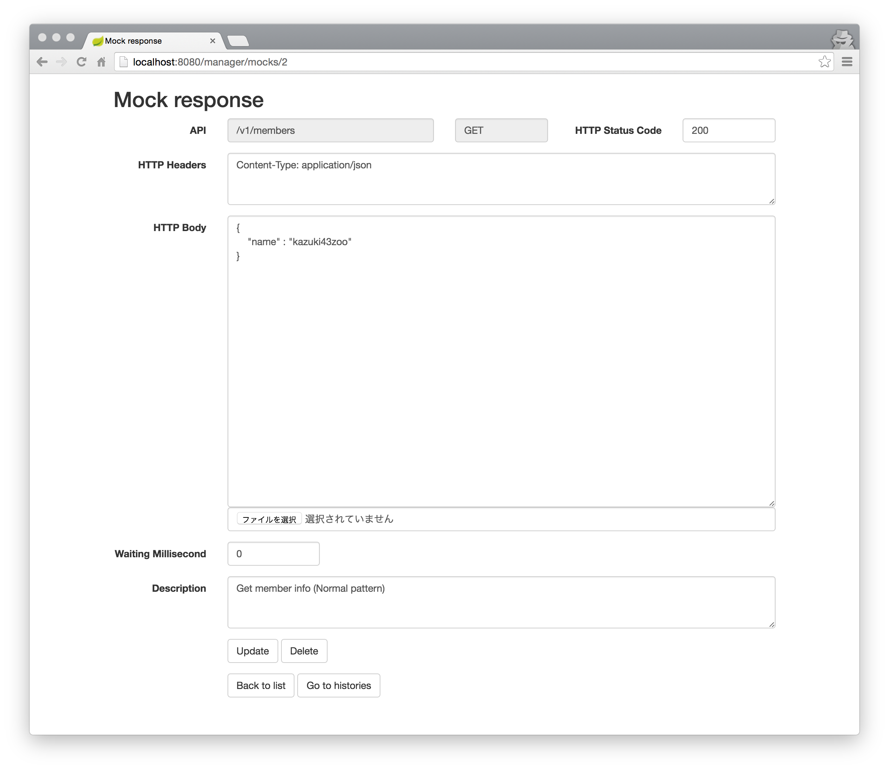

# api-stub

Web API用のスタブアプリケーションです。

## ビルド

```bash
$ ./mvnw clean install
```

## アプリケーションの起動

```bash
$ java -jar api-stub-app/target/api-stub.jar
```

> **ノート**
> 
> デフォルトのサーバー(組み込みTomcat)のポート番号は `8080` です。

## アプリケーションの停止

"Ctrl + C" をタイプしてください。

## サーバーのポート番号の変更方法

サーバーのポート番号を変更したい場合は、以下のように(`--server.port=xxxx` オプションを追加して)アプリケーションを起動してください。

例)

```bash
java -jar api-stub.jar --server.port=9999
```

## 使い方

### 疑似レスポンスの管理画面へのアクセス方法

[http://localhost:8080/](http://localhost:8080/)



#### 擬似レスポンスの追加



#### 擬似レスポンスの編集






### 疑似APIへのアクセス方法

```bash
$ curl -D - http://localhost:8080/api/v1/members
HTTP/1.1 200 OK
Server: Apache-Coyote/1.1
x-correlation-id: f8b9eab7-b18a-4713-8910-88ad719ccb86
Content-Length: 0
Date: Thu, 30 Jun 2016 04:03:06 GMT

```

## エビデンス

エビデンス（リクエストヘッダー、リクエストパラメータ、リクエストボディー、アップロードファイル）は、アプリケーションのルートディレクトリ上の「`evidence`」ディレクトリの中に出力します。

例)

```text
${APP_ROOT}/evidence
└─api
    └─v1
        └─members (* request path)
            └─GET (* http method)
                └─20160630151351369_dbf5d14d-179c-418d-8c25-ad3e55fefe37 (* ${datetime}_${x-correlation-id})
                    + request.json (* include http headers, request parameters)
                    + body.txt (* request body)
                    + uploadFile_01_xxxx.png (* upload files)
```

以下のようにすることで、エビデンスの出力を無効化することができます。

```properties
# Disable request header, request parameter, request body
api.evidence.disabled-request=true
# Disable upload files
api.evidence.disabled-upload=true
```

## コンソールログ

例)

```text
...
2016-06-30 15:09:48.555  INFO 2372 --- [nio-8080-exec-6] GET /api/v1/members                      : Start.
2016-06-30 15:09:48.555  INFO 2372 --- [nio-8080-exec-6] GET /api/v1/members                      : Evidence Dir : D:\Users\xxx\git\api-stub\evidence\api\v1\members\GET\20160630150948555_878abb0d-4828-479f-83cf-3003ae257414
2016-06-30 15:09:48.633  INFO 2372 --- [nio-8080-exec-6] GET /api/v1/members                      : Request      : {"parameters":{},"headers":{"host":["localhost:8080"],"user-agent":["curl/7.46.0"],"accept":["*/*"]}}
2016-06-30 15:09:48.664  INFO 2372 --- [nio-8080-exec-6] GET /api/v1/members                      : Response     : {"httpStatus":"OK","headers":{"x-correlation-id":["878abb0d-4828-479f-83cf-3003ae257414"]}}
2016-06-30 15:09:48.664  WARN 2372 --- [nio-8080-exec-6] GET /api/v1/members                      : Mock Response is not found.
2016-06-30 15:09:48.664  INFO 2372 --- [nio-8080-exec-6] GET /api/v1/members                      : End.
...
```

## データベースへのアクセス

疑似レスポンスを管理しているデータベースに直接アクセスすることができます。

### H2の管理コンソール画面の利用

[http://localhost:8080/h2-console/](http://localhost:8080/h2-console/)

| 項目 | 項目値 |
| ---- | ----- |
| ドライバクラス | `org.h2.Driver` |
| JDBCのURL | `jdbc:h2:~/db/api-stub` |
| ユーザー名 | `sa` |
| パスワード | |

### JDBCドライバの利用

JDBCドライバは[ここ](http://repo2.maven.org/maven2/com/h2database/h2/1.4.191/h2-1.4.191.jar)からダウンロードしてください。

| 項目 | 項目値 |
| ---- | ----- |
| ドライバクラス | `org.h2.Driver` |
| JDBCのURL | `jdbc:h2:tcp://localhost:9092/~/db/api-stub` |
| ユーザー名 | `sa` |
| パスワード | |


## 付録

### アプリケーションに「api-stub-core」をインストールする方法

まず、`api-stub-core` をMavenのローカルリポジトリにインストールしてください。(**重要**)

```bash
$ cd {api-stub-dir}
$ ./mvnw clean install
```

次に、以下のように `api-stub-core` を `pom.xml` に追加してください。

```xml
<dependency>
    <groupId>com.kazuki43zoo</groupId>
    <artifactId>api-stub-core</artifactId>
    <version>1.0.0-SNAPSHOT</version>
</dependency>
```

## 既知の問題

https://github.com/kazuki43zoo/api-stub/issues

## 機能要望やバグレポート

https://github.com/kazuki43zoo/api-stub/issues/new

