# リファレンス

## インストール直後のレスポンス

スタブをインストールした直後の状態では、APIスタブは常に「200 OK」で空のボディを返却します。

```
$ curl -D - -s http://localhost:8080/api/test
HTTP/1.1 200
x-correlation-id: dca267d8-3955-43cf-89f1-4b838c4f5f24
Content-Length: 0
Date: Fri, 28 Oct 2016 07:52:26 GMT

```

> **Note:**
>
> デフォルトでは、`"/api"`で始まるパスがAPIスタブで扱うパスになります。
> このパスは、`api.root-path`プロパティでカスタマイズ可能です。
>
> パスの変更例）
>
> ```
> $ java -jar api-stub.jar --api.root-path=/webapi
> ```
>
> ```
> $ curl -D - -s http://localhost:8080/webapi/test
> HTTP/1.1 200
> x-correlation-id: dca267d8-3955-43cf-89f1-4b838c4f5f24
> Content-Length: 0
> Date: Fri, 28 Oct 2016 07:52:26 GMT
>
> ```


## 任意のレスポンスを返却

ほとんどのケースでは、「200 OK」の空ボディをレスポンスされても困るはずなので、任意のレスポンスを返却する方法を見ていきましょう。
ここでは、会員情報を取得するAPI「GET /api/v1/members/{memberId}」を例に、任意のレスポンスを返却する方法について説明していきます。

### レスポンスデータの作成

まず、APIスタブのUI機能を使ってレスポンスデータを作成します。
ブラウザのアドレスバーに「[http://localhost:8080/](http://localhost:8080/)」を入力してトップ画面（レスポンス一覧）を表示し、「追加」ボタンをクリックします。

> **Note:**
>
> UIの言語を日本語にしたい場合は、ヘッダメニューの「Language」で「Japanese」を指定してください。


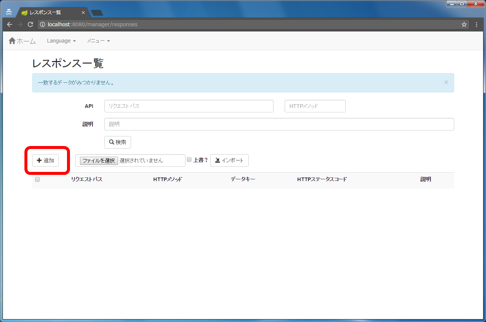

「API（パスとHTTメソッド）」「HTTPボディ」を入力して「保存」ボタンをクリックします。
なお、要件にあわせて「HTTPヘッダ」「HTTPレスポンス」「待ち時間」の値も変えてください。

> **Note:**
>
> レスポンスタイムアウトのテストを行いたい場合は、「待ち時間」を指定することでAPIのレスポンスを遅延させることができます。


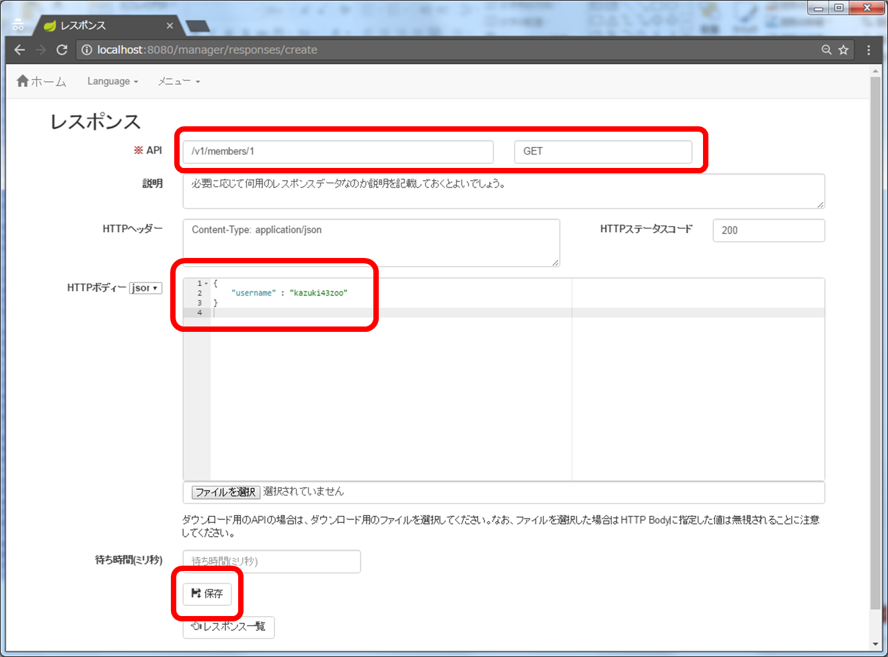


### APIへアクセス

作成したAPI（「GET /api/v1/members/1」）へアクセスすると、作成したレスポンスデータが返却されます。

```
$ curl -D - -s http://localhost:8080/api/v1/members/1
HTTP/1.1 200
x-correlation-id: 686cb079-782b-4110-9ce0-1b93061ff255
Content-Type: application/json;charset=UTF-8
Transfer-Encoding: chunked
Date: Fri, 28 Oct 2016 08:49:09 GMT

{
    "username" : "kazuki43zoo"
}

```

## リクエスト内容に応じたレスポンスの切替

### パスによる切替

RESTfulなURL設計にしている（データを識別するIDがリクエストパスに含まれる）場合は、特別な操作は不要です。

#### レスポンスデータの作成

ここでは、会員情報を取得するAPI「GET /api/v1/members/{memberId}」を例に、「404 Not Found」エラーを発生させるレスポンスデータを作成しましょう。

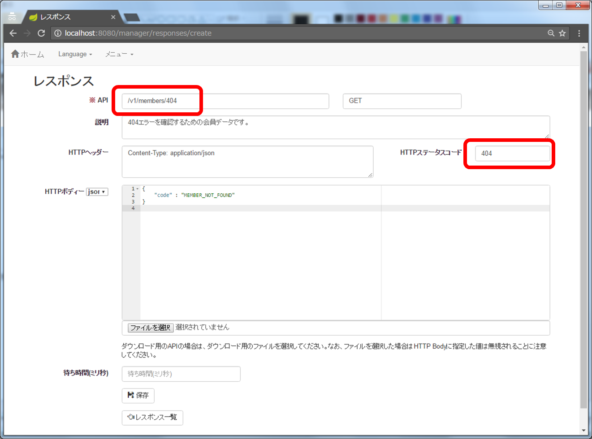

#### APIへのアクセス

作成したAPI（「GET /api/v1/members/404」）へアクセスすると、作成したレスポンスデータが返却されます。

```
$ curl -D - -s http://localhost:8080/api/v1/members/404
HTTP/1.1 404
x-correlation-id: 57b33483-7a3f-421e-bc11-5c031e7e0bda
Content-Type: application/json;charset=UTF-8
Transfer-Encoding: chunked
Date: Fri, 28 Oct 2016 09:32:45 GMT

{
    "code" : "MEMBER_NOT_FOUND"
}

```

### パス以外による切替

RESTfulなURL設計にしていない（データを識別するIDがリクエストパスに含まれない＝ボディやパラメータにある）場合は、データの識別子を抽出するためのAPI定義を行う必要があります。
まず、どうやってデータを識別するIDを抽出するか指定しましょう。

ここでは、カード情報を取得するAPI「POST /api/v1/card/get」を例（リクエストを識別するIDはJSONから取得する例）に、API定義を行う方法について説明します。

リクエストボディ(JSON)のサンプル:

```json
{
    "cardNo" : "0000000001"
}
```

#### API定義の追加

ブラウザのアドレスバーに「[http://localhost:8080/manager/apis](http://localhost:8080/manager/apis)」を入力してAPI一覧を表示し、「追加」ボタンをクリックします。


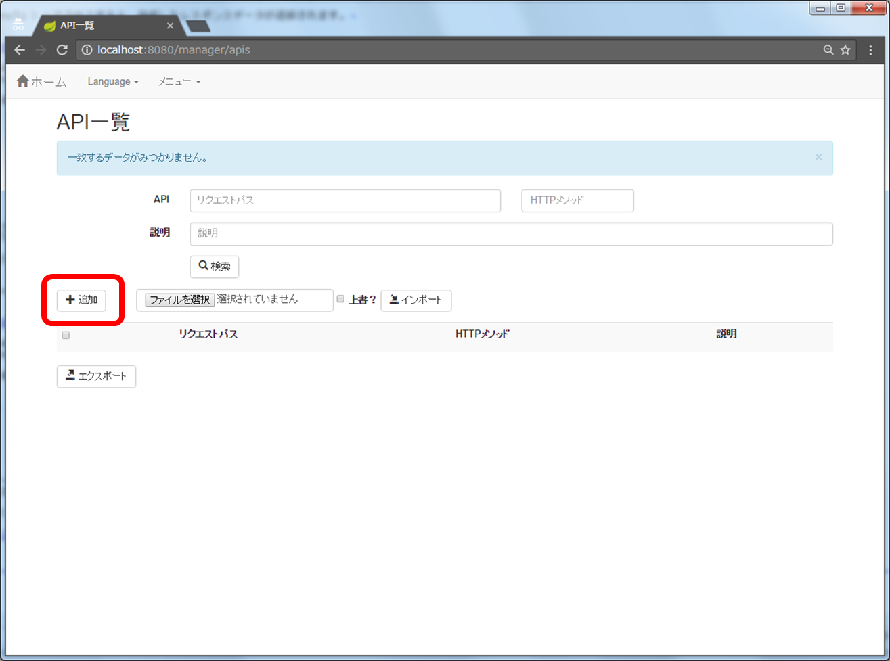


「API（パスとHTTメソッド）」「キーの抽出元」「キーの抽出ルール」「キーの生成方法」を入力して「保存」ボタンをクリックします。
なお、「プロキシ設定」はデフォルト（無効の状態）のままにしてください。

> **Note:**
>
> 「キーの生成方法」には、「最初にマッチしたルールを利用して生成」か「全てのルールを使用して生成」のいずれかを選択してください。
> 「キーの抽出ルール」を複数指定＋それらのルールをAND条件（＝複合キー）として扱いたい場合は、「全てのルールを使用して生成」を選択します。


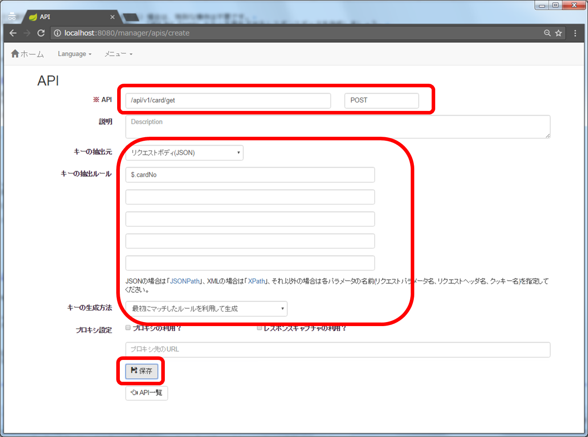


#### レスポンスデータの作成


「任意のレスポンスを返却」のところで紹介した内容と同じ要領で、レスポンスデータを作成します。「データを識別するID」は、データを作成した後に更新するスタイルになっています。

> **Note:**
>
> 次バージョンにて、作成時に「データを識別するID」を指定できるように改善する予定です。


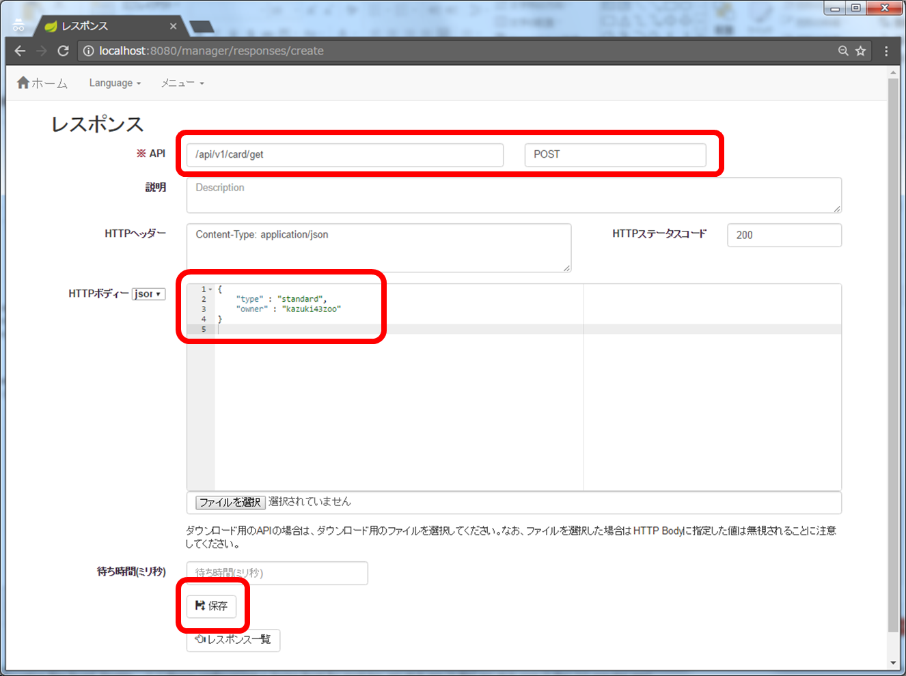

データ登録後に「データキー」（「データを識別するID」）を指定して保存します。

> **Note:**
>
> 「キーの抽出ルール」を複数指定＋「キーの生成方法」に「全てのルールを使用して生成」を選択した場合は、各キー値を「`/`」を結合した値をを指定してください。例）「0000000001/001」

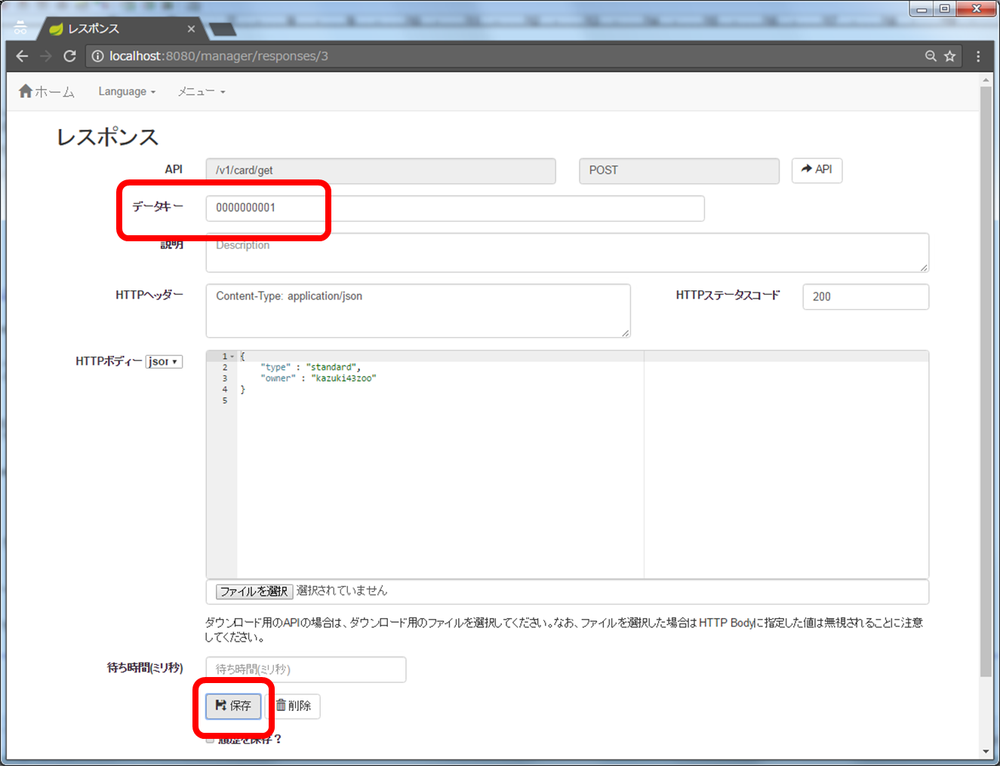


#### APIへのアクセス

作成したAPI（「POST /api/v1/card/get」）へアクセスすると、作成したレスポンスデータが返却されます。


```
$ curl -D - -s -X POST http://localhost:8080/api/v1/card/get -H 'Content-Type: application/json' -d '{"cardNo":"0000000001"}'
HTTP/1.1 200
x-correlation-id: e8e150c0-d6e3-47d6-8457-6f1b924da00b
Content-Type: application/json;charset=UTF-8
Transfer-Encoding: chunked
Date: Fri, 28 Oct 2016 10:58:28 GMT

{
    "type" : "standard",
    "owner" : "kazuki43zoo"
}

```

### 切替方法のバリエーション

パスやJSON以外にも、以下の方法をサポートしています。

* XML
* リクエストパラメータ
* リクエストヘッダ
* クッキー

#### XML

XML形式を使う場合のAPI定義は以下のような感じになります。

リクエストボディのサンプル:

```xml
<request>
    <cardNo>0000000001</cardNo>
</request>
```

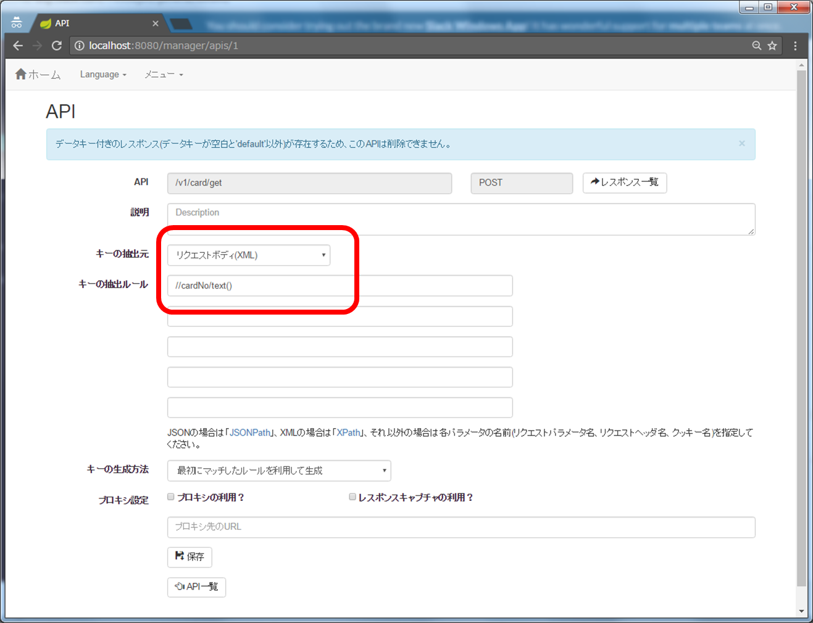


作成したAPI（「POST /api/v1/card/get」）へアクセスすると、作成したレスポンスデータが返却されます。（レスポンスがJSONですが・・）

```

$ curl -D - -s -X POST http://localhost:8080/api/v1/card/get -H 'Content-Type: application/xml' -d '<request><cardNo>0000000001</cardNo></request>'
HTTP/1.1 200
x-correlation-id: b3d491aa-d8a0-4174-a88a-109114cc2f72
Content-Type: application/json;charset=UTF-8
Transfer-Encoding: chunked
Date: Fri, 28 Oct 2016 11:22:10 GMT

{
    "type" : "standard",
    "owner" : "kazuki43zoo"
}

```

#### リクエストパラメータ


リクエストパラメータを使う場合のAPI定義は以下のような感じになります。

リクエストボディのサンプル:

```
cardNo=0000000001
```

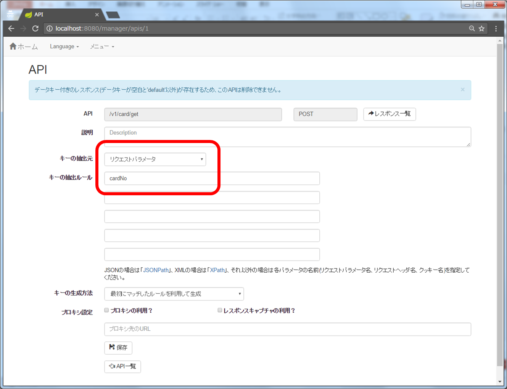


作成したAPI（「POST /api/v1/card/get」）へアクセスすると、作成したレスポンスデータが返却されます。（レスポンスがJSONですが・・）

```
$ curl -D - -s -X POST http://localhost:8080/api/v1/card/get -d 'cardNo=0000000001'
HTTP/1.1 200
x-correlation-id: 2c2f53b8-7e90-4b7b-9e45-83f45166ed76
Content-Type: application/json;charset=UTF-8
Transfer-Encoding: chunked
Date: Fri, 28 Oct 2016 11:24:18 GMT

{
    "type" : "standard",
    "owner" : "kazuki43zoo"
}

```

> **Note:**
>
> リクエストパラメータは、クエリ文字列として指定することもできます。
>
> ```
> $ curl -D - -s -X POST http://localhost:8080/api/v1/card/get?cardNo=0000000001
> ```

#### リクエストヘッダ/クッキー

リクエストパラメータと同じ要領で、抽出ルールにヘッダ名やクッキー名を指定してください。（説明は割愛します）

## エクスポートとインポート

API定義やモックレスポンスのデータを複数の開発者で共有したい場合は、作成したデータをファイルにエクスポートし、エクスポートしたファイルをインポートすることで実現することができます。

### API定義のエクスポートとインポート

#### エクスポート

「エクスポート」ボタンをクリックしてください。API定義が全件エクスポートされます。（＝エクスポート対象の選択はできません）

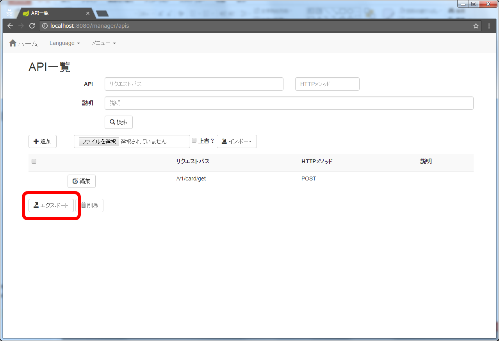

#### インポート

インポート対象のファイルを選択して「インポート」ボタンをクリックしてください。デフォルトの動作では、インポート先に同じAPIの定義があると既にあるデータが優先されます。インポートファイルの中身で上書きしたい場合は、「上書？」チェックボックスを「ＯＮ」にしてください。

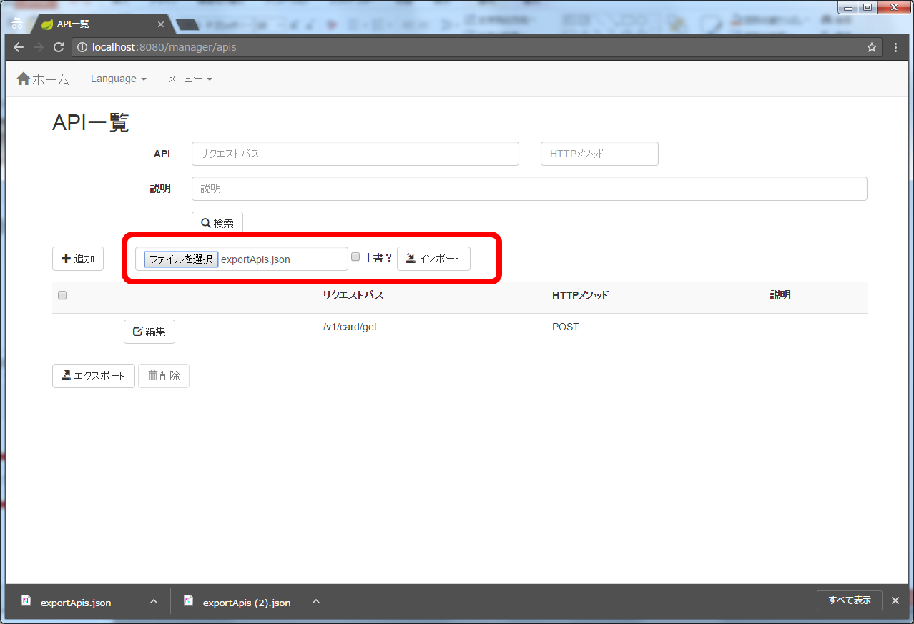

### モックレスポンスのエクスポートとインポート

#### エクスポート

エクスポート対象にするデータを選択し、「エクスポート」ボタンをクリックしてください。

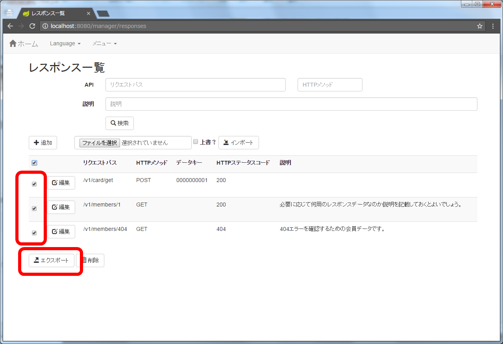

#### インポート

インポート対象のファイルを選択して「インポート」ボタンをクリックしてください。デフォルトの動作では、インポート先に同じレスポンスデータがあると既にあるデータが優先されます。インポートファイルの中身で上書きしたい場合は、「上書？」チェックボックスを「ＯＮ」にしてください。

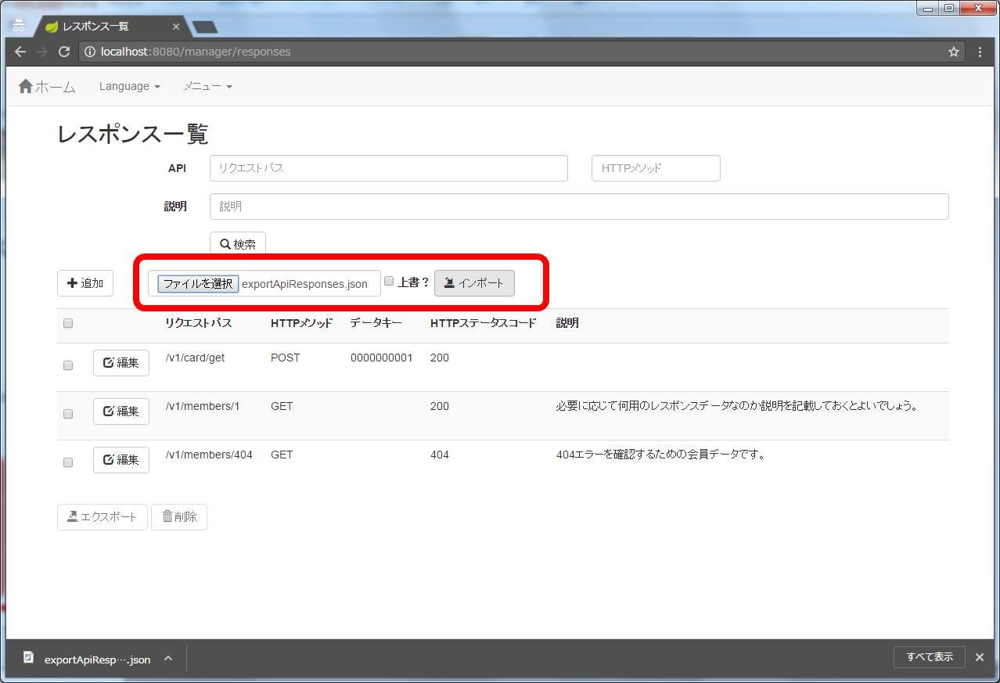


## 履歴と履歴からの復元

モックレスポンスデータについては、変更履歴を保存することができ、履歴からデータを復元することも可能です。デフォルトの動作では、新規にデータを作成した時のみ履歴を保存するようになっています。

### 変更履歴の保存

変更履歴を保存する場合は、「履歴を保存？」チェックボックスを「ＯＮ」にして保存してください。

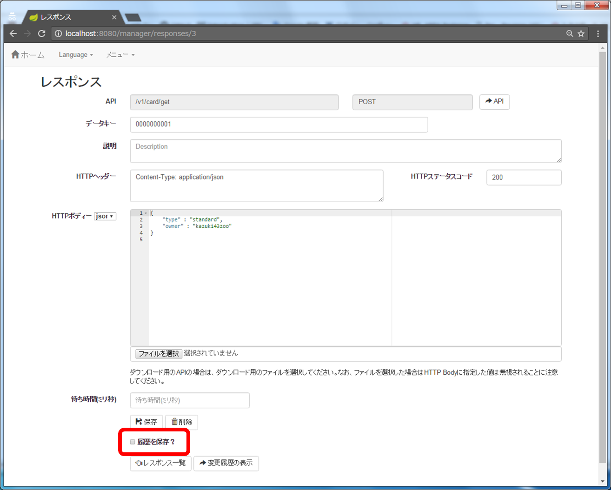


### 履歴からの復元

履歴からのモックレスポンスのデータを復元する場合は、変更履歴画面の「復元」ボタンをクリックしてください。

> **Note:**
>
> 変更履歴画面の表示は、以下の操作で行うことができます。
>
> * レスポンス保存画面で「変更履歴の表示」
> * 変更履歴一覧画面で復元対象の履歴の「表示」ボタンをクリック

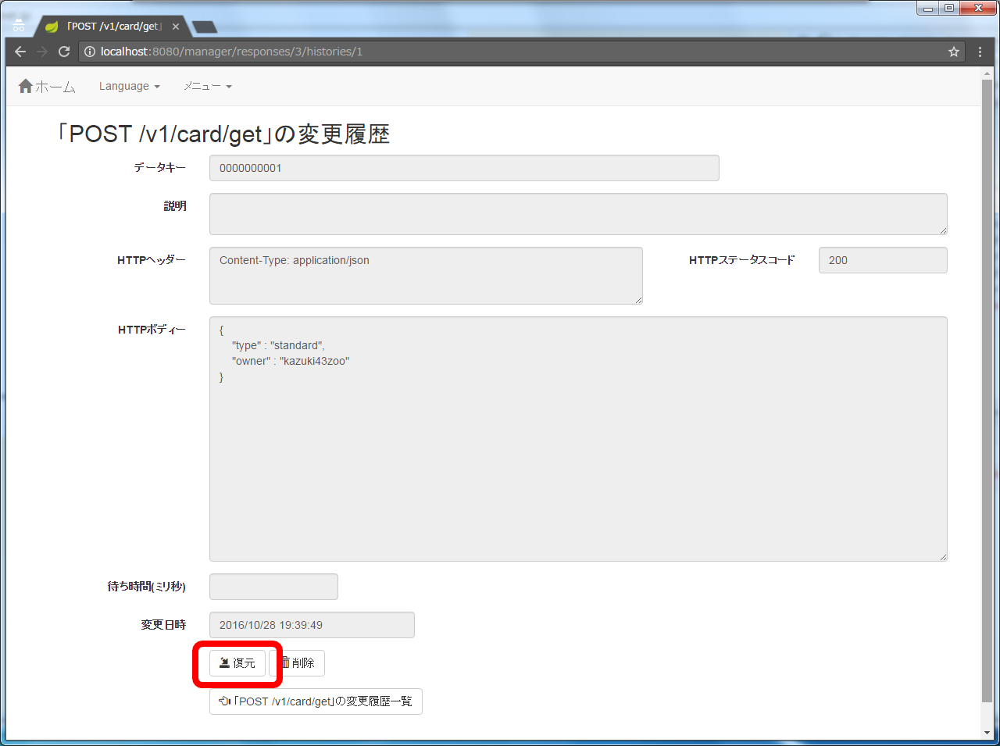
